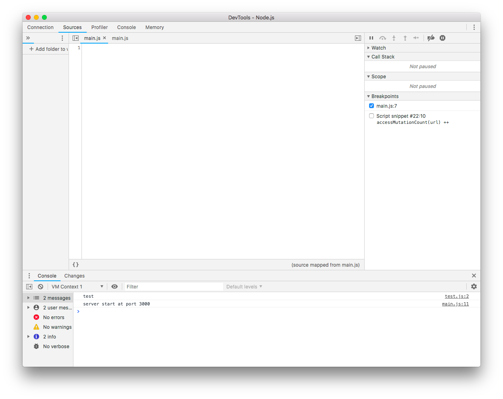

# esm-sourcemaps-broken

Run with:

`npm install`

`ESM_OPTIONS={'cjs':{'paths':true}} NODE_PATH=./ node --inspect -r esm main.js`

Crhome Version 72.0.3626.121 (64-bit), 
`npm -v 6.7.0`, `node -v v11.11.0`

Problem: 

Sourcemaps is not working and the code disappears when remote debugging

